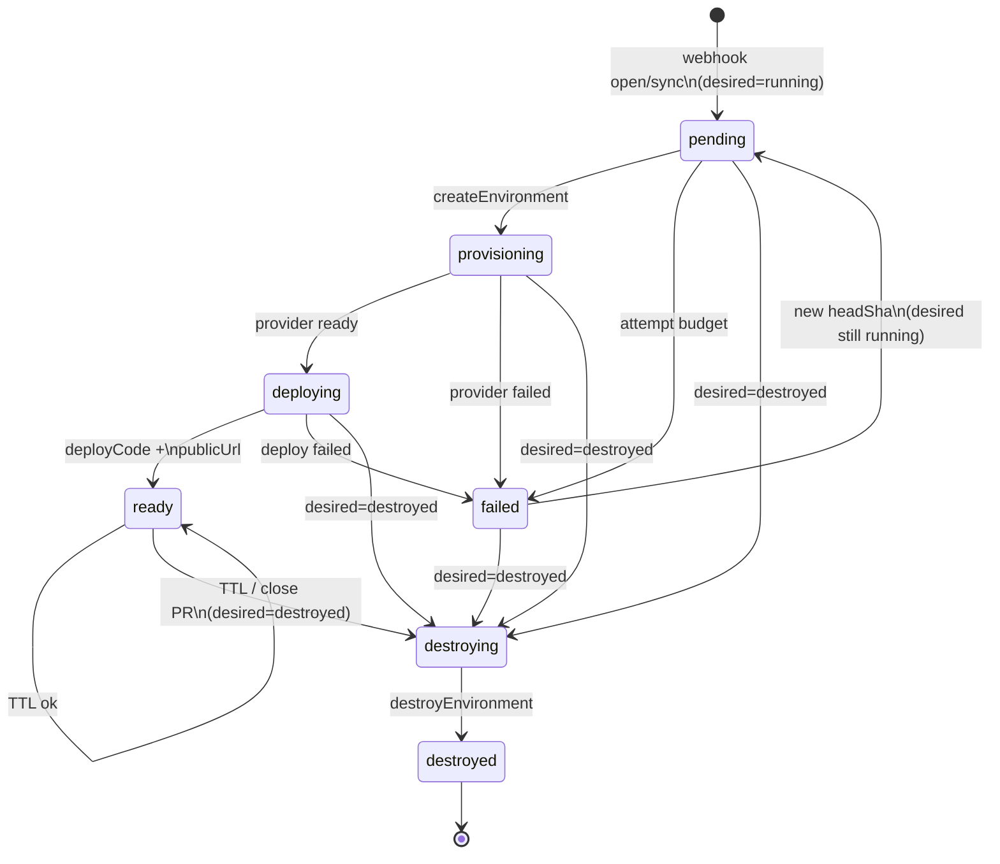

# Ephemera

Ephemeral PR preview environments on [Zerops](https://zerops.io).

Open a pull request → Ephemera provisions a throwaway stack, posts a working URL on the PR, and tears it down when the PR closes (or the TTL expires).

## Architecture

```
GitHub webhook ──► api (Hono) ──► desired state in Postgres
                      │                ▲
                      ▼                │
                   BullMQ/Valkey       │
                      │                │
                      ▼                │
                   worker ──► Provider (Mock | Zerops) ──► preview services
                      │
                      └── upserts PR comment with publicUrl

web (static) ──nginx /api proxy──► api   (same Zerops project, private DNS)
```

Two Zerops projects:

| Project | Role |
|---|---|
| **ephemera** (this repo’s `zerops-project-import.yml`) | Control plane: `web`, `api`, `worker`, `db`, `queue` |
| **ephemera-envs** | Preview environments created by `ZeropsProvider` (`pr{N}…` hostnames) |

The webhook handler never talks to the Provider. It only writes **desired state**. The worker reconciler is the only path that creates, deploys, or destroys infrastructure.

### Reconciler state machine

`desiredState`: `running` | `destroyed`  
`actualState`: `pending` → `provisioning` → `deploying` → `ready` (or `failed`) → `destroying` → `destroyed`



One reconciler tick advances **at most one** step (`reconcileOnce`). Retries are safe: every Provider method is idempotent.

## Local setup

```bash
# Node 22 + pnpm
pnpm install
docker compose up -d          # postgres:16 + valkey
cp .env.example .env          # edit secrets
pnpm db:migrate
pnpm dev                      # api :3000, worker, web :5173
```

Useful scripts:

| Script | Purpose |
|---|---|
| `pnpm drive:mock-provider` | Provider lifecycle on MockProvider |
| `pnpm gate:reconciler` | Crash-safe reconciler gate |
| `pnpm gate:compose-import` | compose → preview.yml importer |
| `PROVIDER=zerops pnpm smoke` | Real Zerops create→deploy→destroy (spends credits) |

Keep `PROVIDER=mock` for day-to-day. Only checkpoints 7–8 need real Zerops credits.

## Deploy Ephemera to Zerops

Requires credit balance > 0. Preview envs stay in the separate LIGHT project.

```bash
# 1) Import control-plane project (creates web/api/worker/db/queue)
zcli login "$ZEROPS_API_TOKEN"
zcli project project-import zerops-project-import.yml --org-id "$ZEROPS_ORG_ID"
# note the new project id → EPHEMERA_APP_PROJECT_ID

# 2) Set secrets on api + worker (Zerops GUI → Environment variables)
#    api:    GITHUB_WEBHOOK_SECRET, GITHUB_TOKEN
#    worker: GITHUB_TOKEN,
#            EPHEMERA_PREVIEW_TOKEN, EPHEMERA_PREVIEW_PROJECT_ID=<ephemera-envs id>
#    (Zerops forbids custom ZEROPS_* keys on its platform; local .env still uses them.)

# 3) Push code
zcli push api    -P "$EPHEMERA_APP_PROJECT_ID"
zcli push worker -P "$EPHEMERA_APP_PROJECT_ID"
zcli push web    -P "$EPHEMERA_APP_PROJECT_ID"
```

- **api** / **web**: public Zerops subdomains (`enableSubdomainAccess`)
- **worker**, **db**, **queue**: private only
- **api** runs `pnpm --filter @ephemera/api db:migrate` as an `initCommands` step
- **api** / **worker** read `DATABASE_URL=${db_connectionString}` and `REDIS_URL=${queue_connectionString}`
- **web** builds with `VITE_API_BASE=https://api-${zeropsSubdomainHost}-3000.prg1.zerops.app` (api has `CORS_ORIGIN=*`)

Webhook URL for GitHub:

```text
https://api-<subdomainHost>-3000.prg1.zerops.app/webhooks/github
```

Content type: `application/json`. Secret: same as `GITHUB_WEBHOOK_SECRET`. Events: Pull requests.

### Product gate

1. Point a real repo’s webhook at the deployed API.
2. Open a PR (from your phone is fine).
3. Worker posts a comment with a working preview URL (`EPHEMERA_POST_COMMENTS=1`).
4. Close the PR → environment is destroyed.

## Security & scope (v0.1)

- The dashboard is unauthenticated. Deliberate for this release — Ephemera is
  meant to run inside a trusted network or behind your own auth proxy. Auth is
  the first item on the roadmap.
- GitHub tokens are stored per-repo in the control-plane database and are never
  returned by the API.
- Webhook payloads are verified with HMAC-SHA256 over the raw request body.
- Preview environments are isolated per PR and destroyed on close or TTL expiry.

Naming the gap yourself is worth more than hoping nobody looks.

## AI tools used

| Tool | Role |
|---|---|
| **Cursor** (Agent) | Primary implementation environment across checkpoints 0–8 |
| **Cursor Grok 4.5** | Coding agent for scaffolding, Provider/reconciler, Zerops adapter, deploy config |
| **Cursor explore/Task subagents** | Codebase mapping for deploy surface and reconciler FSM |
| **Zerops zCLI + REST API** | Service import, push, status; hostname/type discovery |
| **GitHub CLI (`gh`)** | Intended for repo/webhook/PR gate (requires local `gh auth login`) |

No other AI coding assistants were used for this repository’s implementation work.

## License

Private / unpublished — course project.
